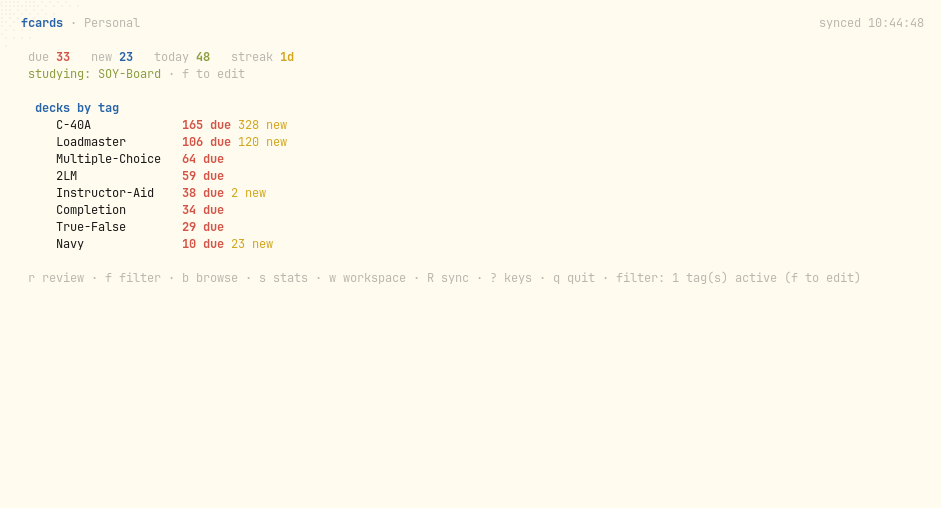

# fcards

A terminal flashcards client for [Flashcards Open Source App](https://github.com/kirill-markin/flashcards-open-source-app), built for [Omarchy](https://omarchy.org/).

Text-first, keyboard-first, function-first. Your cards live in your existing
flashcards-open-source-app account — same decks, same review history, same
streaks as the iOS, Android, and web clients.



## Features

- **Real account sync** — speaks the same offline-first sync contract as the
  official mobile clients (bootstrap + hot-change deltas + atomic review pushes)
- **Proven FSRS scheduler** — a Go port of the product's FSRS-6 scheduler,
  validated against the project's golden parity vectors
  (`fsrs-full-vectors.json`), including deterministic fuzz
- **Offline-first** — review on a plane; pushes queue on disk and flush
  automatically when you reconnect (idempotent, no double-counted reviews)
- **Study by deck or tag** — keyboard autocomplete picker, multi-select,
  persisted per workspace
- **Card images** — `fcasset:` media renders as terminal block-art via
  [chafa](https://hpjansson.org/chafa/) (works in any terminal, including foot)
- **Omarchy-native** — accent colors read from the active Omarchy theme;
  ANSI palette follows your terminal colors, so `omarchy theme set` just works

## Keys

```
r review · b browse · s stats · w workspace · f filter · R sync · ? keys · q quit
review:  space reveal · 1 again · 2 hard · 3 good · 4 easy · s skip · esc back
```

## Install

**AUR** (Arch / Omarchy):

```sh
paru -S fcards            # or your AUR helper of choice
```

**Release binaries** (no Go needed):

```sh
curl -fsSL https://github.com/dmltallen/fcards/releases/download/v0.2.0/fcards-linux-amd64   -o ~/.local/bin/fcards && chmod +x ~/.local/bin/fcards
```

**From source** (Go 1.25+):

```sh
git clone https://github.com/dmltallen/fcards && cd fcards
go build -ldflags="-s -w" -o ~/.local/bin/fcards .
cp packaging/fcards.desktop ~/.local/share/applications/
cp packaging/flashcards.png ~/.local/share/icons/hicolor/512x512/apps/
update-desktop-database ~/.local/share/applications
```

Optional: `pacman -S chafa` for card image rendering.

The desktop entry makes Flashcards appear in the Omarchy Apps menu (and any
freedesktop launcher). On Omarchy you can also install it with
`omarchy install app Flashcards fcards` once the AUR package is live.

## Omarchy bar widget

A [Quickshell bar widget](https://github.com/dmltallen/fcards-omarchy) shows
your due count at a glance — click opens the review session:

```sh
omarchy plugin add https://github.com/dmltallen/fcards-omarchy --enable
```

Omarchy keybinding — add to `~/.config/hypr/bindings.lua`:

```lua
o.bind("SUPER + SHIFT + C", "Flashcards", { launch = "foot -a fcards -e fcards" })
```

First launch walks you through email-OTP sign-in; your API key is stored at
`~/.config/fcards/config.json` (0600).

## Data locations

| Path | Purpose |
|------|---------|
| `~/.config/fcards/config.json` | account, API key, workspace, device ids (0600) |
| `~/.local/share/fcards/state-<workspace>.json` | local cache + sync cursors + study selection |
| `~/.local/share/fcards/outbox.jsonl` | offline review queue |
| `~/.cache/fcards/media/` | downloaded card images |

## How it works

The Agent API surface is read/content-only by design — review submission goes
through the same sync API the mobile apps use: each review is computed locally
with the ported FSRS scheduler and pushed as one atomic batch
(`review_event` append + `card` upsert), exactly like iOS and Android.
The scheduler port is byte-for-byte validated against the upstream project's
golden vectors before it ever touches an account.

## Credits

- [flashcards-open-source-app](https://github.com/kirill-markin/flashcards-open-source-app)
  by Kirill Markin (MIT) — the service, the sync contract, the FSRS
  scheduling semantics, and the golden parity vectors this client validates
  against
- [FSRS](https://github.com/open-spaced-repetition/fsrs4anki/wiki/The-Algorithm)
  by open-spaced-repetition
- Built with [bubbletea](https://github.com/charmbracelet/bubbletea) and
  [ratatui-inspired](https://github.com/charmbracelet/lipgloss) Charm tooling

## License

MIT — see [LICENSE](LICENSE).
